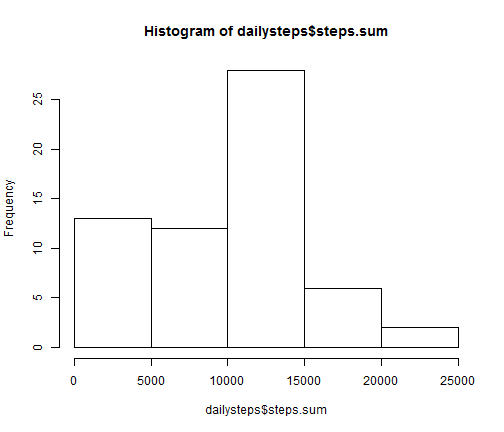
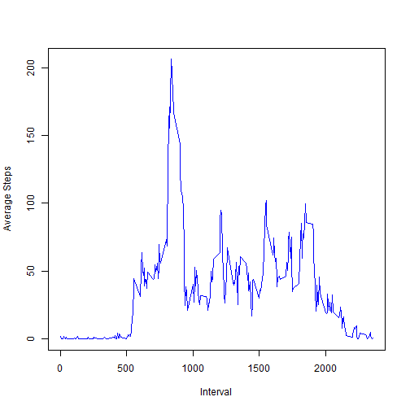
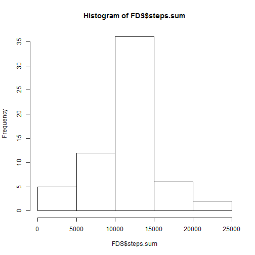
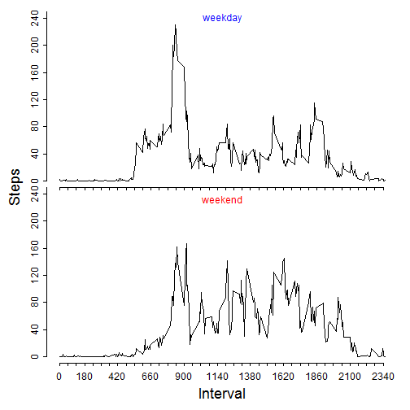

<br>

### Loading and preprocessing the data

First, set the working directory appropriately  
Then,load the data into R, storing the data in the object "coreData"


```r
setwd("C:/Users/Alex Egan/Documents/Online Courses/Johns Hopkins Data Science Specialization/Reproducible Research/RepData_PeerAssessment1")
coreData <- read.csv("activity.csv", sep = ",", dec = ".", header = TRUE)
```

<br>
<br>
<br>
<br>

### What is the mean total number of steps taken per day?
Here, we load a library we will use. The library is called "doBy" and it is useful for summaries of data frames. (Note, we suppress the messages of this process)


```r
library(doBy)
```

Make another dataset which will represent the steps for each day. (Instead of using doBy, we could have used apply and split)


```r
dailysteps <- summaryBy(steps ~ date, data = coreData, FUN = sum, na.rm = TRUE)
head(dailysteps)
```

```
##         date steps.sum
## 1 2012-10-01         0
## 2 2012-10-02       126
## 3 2012-10-03     11352
## 4 2012-10-04     12116
## 5 2012-10-05     13294
## 6 2012-10-06     15420
```

Now that the data is in a nice format, plot it


```r
hist(dailysteps$steps.sum)
```

 

Let's take a look at the mean and median of steps per day


```r
mean(dailysteps$steps.sum)
median(dailysteps$steps.sum)
```

```
## [1] 9354.23
## [1] 10395
```
  
<br>
<br>
<br>
<br>

### What is the average daily activity pattern?

Here's a time series (line) plot of steps per day. But first, make another summary table:

```r
intervalsteps <- summaryBy(steps~interval, data = coreData, FUN = mean, na.rm = TRUE)
plot(intervalsteps, type = "l", col = "blue", ylab = "Average Steps", xlab = "Interval", lwd = 1.5)
```

 

##### "Which 5-minute interval, on average across all days in the dataset, contains the maximum number of steps?" Easy.


```r
intervalsteps$interval[intervalsteps$steps.mean == max(intervalsteps$steps.mean)]
```

```
## [1] 835
```

Looking at our plot, we see that this result seems reasonable.

<br>
<br>
<br>

### Inputing Missing Values

There are different ways to calculate the number of missing values. We will generate a boolean vector and take its sum.


```r
sum(is.na(coreData$steps))
```

```
## [1] 2304
```

To fill the missing values, we will use the mean of that interval over the other days. We already have a convenient location for that data. There are surely a variety of ways to do this, but we will just use a loop.


```r
filledCoreData <- coreData
for (i in 1:(nrow(filledCoreData))) {
    if (is.na(filledCoreData$steps[i])) {
        replacement <- intervalsteps$steps.mean[intervalsteps$interval == filledCoreData$interval[i]]
        filledCoreData$steps[i] <- replacement
    }
}
head(filledCoreData)
```

```
##       steps       date interval
## 1 1.7169811 2012-10-01        0
## 2 0.3396226 2012-10-01        5
## 3 0.1320755 2012-10-01       10
## 4 0.1509434 2012-10-01       15
## 5 0.0754717 2012-10-01       20
## 6 2.0943396 2012-10-01       25
```

Now, we repeat the process we used with the original data set. Now, we store the name of the summary data set in a variable "FDS" (for "Filled Daily Steps")


```r
FDS <- summaryBy(steps ~ date, data = filledCoreData, FUN = sum)
hist(FDS$steps.sum)
```

 

Calculate the mean and median of daily steps:


```r
mean(FDS$steps.sum)
median(FDS$steps.sum)
unique(FDS$steps.sum)
```

```
## [1] 10766.19
## [1] 10766.19
##  [1] 10766.19   126.00 11352.00 12116.00 13294.00 15420.00 11015.00
##  [8] 12811.00  9900.00 10304.00 17382.00 12426.00 15098.00 10139.00
## [15] 15084.00 13452.00 10056.00 11829.00 10395.00  8821.00 13460.00
## [22]  8918.00  8355.00  2492.00  6778.00 10119.00 11458.00  5018.00
## [29]  9819.00 15414.00 10600.00 10571.00 10439.00  8334.00 12883.00
## [36]  3219.00 12608.00 10765.00  7336.00    41.00  5441.00 14339.00
## [43] 15110.00  8841.00  4472.00 12787.00 20427.00 21194.00 14478.00
## [50] 11834.00 11162.00 13646.00 10183.00  7047.00
```

These values are larger than the originally calculated. The mean and median are also the same, which may not be terribly interesting (would seem to imply there is at least one day with all missing data)

<br>
<br>
<br>

### Are there differences in activity patterns between weekdays and weekends?

To obtain the weekdays, we first need to make the date variable of type string. Then, make that string of type "Date".

```r
weekdays <- weekdays(as.Date(as.character(filledCoreData$date)))
head(weekdays)
weekdays <- 1*is.element(weekdays, c("Monday", "Tuesday", "Wednesday", "Thursday", "Friday"))
head(weekdays)
unique(weekdays)
```

```
## [1] "Monday" "Monday" "Monday" "Monday" "Monday" "Monday"
## [1] 1 1 1 1 1 1
## [1] 1 0
```

Use the factor() function to make a factor variable in filledCoreData


```r
filledCoreData$dayType <- factor(weekdays, labels = c("weekend","weekday"))
head(filledCoreData$dayType)
```

```
## [1] weekday weekday weekday weekday weekday weekday
## Levels: weekend weekday
```

```r
unique(filledCoreData$dayType)
```

```
## [1] weekday weekend
## Levels: weekend weekday
```

To make graphs of weekday and weekend versions of the mean amount of steps, we will first make dataframes which will hold data on these mean values.


```r
weekdayIntervalSteps <- summaryBy(steps ~ interval, data = filledCoreData[as.character(filledCoreData$dayType) == "weekday",], FUN = mean, keep.names = TRUE)
weekendIntervalSteps <- summaryBy(steps ~ interval, data = filledCoreData[as.character(filledCoreData$dayType) == "weekend",], FUN = mean, keep.names = TRUE)
```

To plot these data in panel form, we will need to do a lot of formatting.


```r
par(mfrow = c(2,1))
par(mar = c(0,0,0,0), oma = c(4,4,1,1))
par(tcl = -0.25)
par(mgp = c(2,0.6,0))
plot(y = weekdayIntervalSteps$steps, x = weekdayIntervalSteps$interval, axes = FALSE, type = "l", lwd = 1.2, ylim = c(0,240))
axis(2,at = seq(0, 280,40))
axis(1, labels = FALSE, at = seq(0,max(weekdayIntervalSteps$interval),60))
mtext("weekday", line = -1, col = "blue")
plot(y = weekendIntervalSteps$steps, x = weekdayIntervalSteps$interval, axes = FALSE, type = "l", lwd = 1.2, ylim = c(0,240))
axis(2,at = seq(0, 280,40))
axis(1, at = seq(0,max(weekdayIntervalSteps$interval),60))
mtext("weekend", line = -1.5, col = "red")
mtext("Interval", side = 1, outer = TRUE, cex = 1.5, line = 2.2)
mtext("Steps", side = 2, outer = TRUE, cex = 1.5, line = 2.2)
```

 


